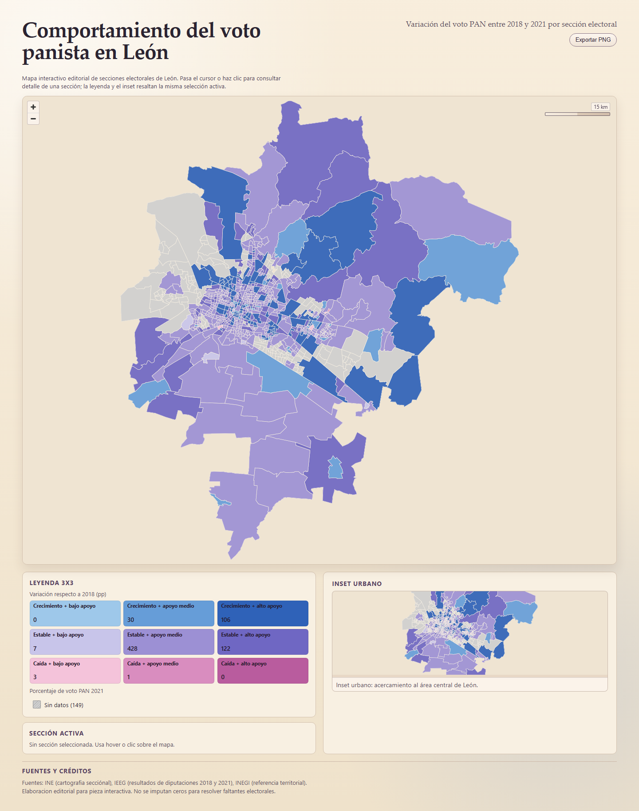

# Geospatial Electoral Visualization - Leon, Guanajuato
Interactive editorial map for analyzing PAN vote variation between 2018 and 2021 across electoral sections.

## Overview
This project turns official electoral and geographic datasets into an interactive editorial map focused on territorial interpretation.  
It visualizes how PAN vote share changed between 2018 and 2021 across Leon's electoral sections using a bivariate choropleth design.  
The result combines data analysis, geospatial visualization, and executive-style communication in a single public-facing artifact.  
It is designed as a narrative visualization, not a dashboard, with export-ready output for reporting and presentations.

## Live Demo
Public demo: [https://voto-panista-leon.vercel.app/](https://voto-panista-leon.vercel.app/)

Validated screenshot / PNG export:



## Why this project matters
This project demonstrates how official electoral and territorial data can be transformed into a clear visual product that supports interpretation, geographic exploration, and communication of findings for decision-making contexts.

## What this project demonstrates
- Data cleaning and spatial data preparation.
- Geospatial visualization with MapLibre.
- Bivariate classification and visual encoding.
- Executive-style data storytelling.
- Reproducible frontend and export workflow.
- Quality checks and documented assumptions.
- Ability to translate complex data into a clear visual deliverable.

## Tech Stack
- Next.js + React + TypeScript
- MapLibre GL JS
- html-to-image
- Playwright
- Custom editorial CSS

## Data Sources
- INE: cartografía seccional.
- IEEG: resultados de diputaciones locales 2018 y 2021.
- INEGI: referencia territorial contextual.

Only processed/public-facing artifacts are included for the web app; raw data intake is documented separately.

Frontend-consumed artifacts:
- `public/data/secciones.geojson`
- `public/config/editorial-map-spec.json`

## Methodology
- Final spatial universe: `846` electoral sections in León.
- Bivariate 3x3 classification plus `no_data`.
- Horizontal axis: `% PAN 2021` (`low <40`, `mid 40-<60`, `high >=60`).
- Vertical axis: variation vs 2018 (`decline <-10`, `stable -10 to 10`, `growth >10`).
- Missing-data handling: no zero imputation.
- Sections without sufficient classification inputs are tagged as `no_data`.

## Repository Structure
- `app/`
- `components/`
- `lib/`
- `styles/`
- `public/data/`
- `public/config/`
- `public/images/`
- `scripts/`
- `data/processed/`
- `data/raw/README.md`
- `docs/`
- `reports/`

## Run Locally
```bash
npm install
npm run dev
npm run lint
npm run build
```

## Export PNG
Via UI:
- Use the `Exportar PNG` button in the app.

Via CLI (recommended for stable portfolio output):
```bash
npm run export:png
```

Notes:
- Default CLI export URL: `http://127.0.0.1:4173`.
- If no server is running there, the script starts a temporary one.
- To target another URL, use `EXPORT_URL`.
- If Playwright Chromium is missing, run:
```bash
npx playwright install chromium
```

Output path:
- `exports/leon_pan_bivariate_desktop.png`

## Project Status
- Portfolio-ready `v1.1.0`
- Public demo available
- Future improvements documented

## Known Limitations
- Urban inset remains editorial and could be formalized with explicit geometry.
- Graphic scale is approximate and depends on zoom/latitude.
- UI export may vary by browser/GPU; Playwright CLI is the most stable option.
- No full cross-browser visual regression suite yet.

## Future Improvements
- Formalize urban inset geometry.
- Improve accessibility coverage.
- Add automated visual testing.
- Expand deployment documentation.
- Adapt the framework to additional territorial and operational use cases.
